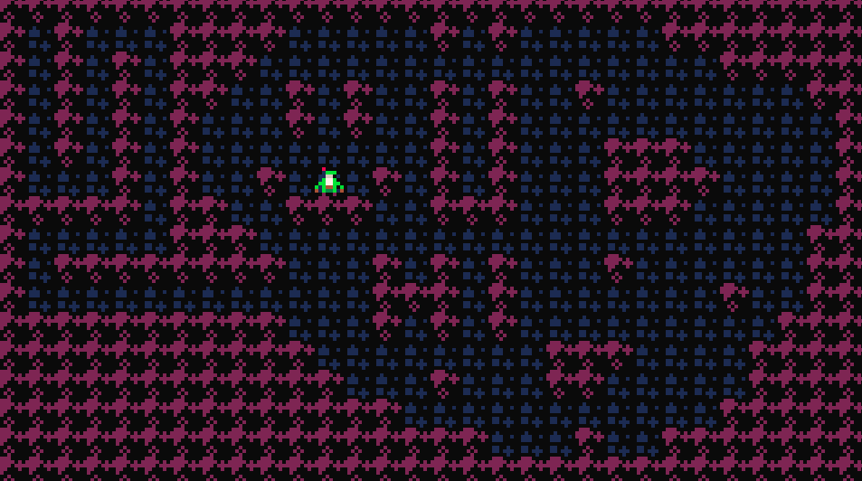

# Project Bardsong (Working title)
> Your party is gone, and you're all thats left. Will you be the one to escape the lair of the Necromancer?
> Project Bardsong is a top down dungeon crawling puzzler game with big boss fights, powerful item synergies, and fast paced gameplay that keeps you on your toes. 

  

## Mechanics
- 3 Level types over 4 floors:
  - Escape:
    - A basic level, get to the exit alive and collect coins if you can.
    - Character runs until they hit a wall, goal is to avoid taking any damage
    - Player can use consumables to help here, any attack consumables target the nearest enemy
    - Passive items also work here
  - Store:
    - Buy items and consumables
    - Always one before boss fight
  - Combat:
    - Boss rooms always mark the end of the floor
    - Fight and defeat the boss to continue and exit to the next floor.
    - Player movement is changed to more traditional top down movement to represent that there is no escape without killing the boss.
    - Classic boss-fight loop, i.e., attack phase, damage phase, and health-based phases.
- Simple controls:
  - WASD/arrows to move
  - Q/Z to use consumable
  - E/X to use ability
- Player has limited health and only one life
  - Taking damage reduced health and stuns the player, stopping them one tile in the opposite direction of movement.
  - Player can regain health through consumables or by reaching the next floor

## Stretch goals
---
- Different playable character classes with different play styles, i.e. movement types, innate passive, etc.
- Custom level editor for making challenge runs for others
- Procedural levels for more run variability
- Modding support for Bosses, enemies, characters, and items

## Schedule
---
- [ ] Game Core - 1 month
  - [ ] Player Controls & Basic Menus - 1 week
  - [ ] Item base, passive and consumable - 1 week
  - [ ] Enemy Base - 1 week
  - [ ] Level Base - 1 week
- [ ] Enemy and Item Design - 1 month
  - [ ] Enemy designs - 2 weeks
  - [ ] New Passive items - 1 week
  - [ ] New Consumables - 1 week
- [ ] Boss Design - 1 month
  - [ ] Dungeon Boss - 1 week
  - [ ] Crypt Boss - 1 week
  - [ ] Caverns Boss - 1 week
  - [ ] Sewers Boss - 1 week
- [ ] Level Design - 2 months
  - [ ] Dungeon Floor - 2 weeks
  - [ ] Crypt Floor - 2 weeks
  - [ ] Caverns Floor - 2 weeks
  - [ ] Sewers Floor - 2 weeks
- [ ] UI Design - 1 month
- [ ] Polish - 1 month
- [ ] Marketing Materials and Store page - 1 month
---
**TOTAL TIME-TO-MARKET** ~8 months
